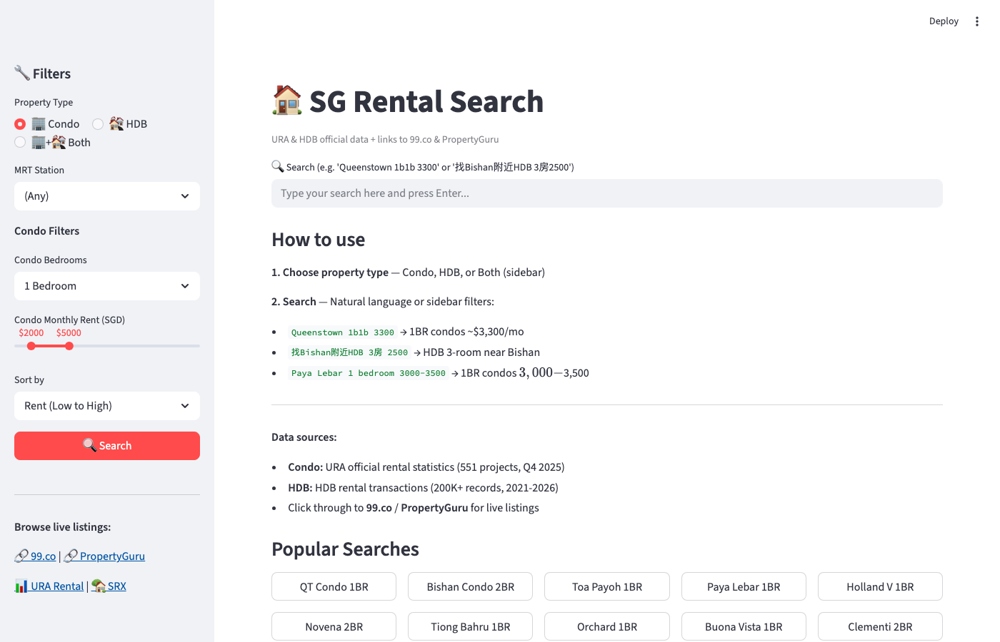
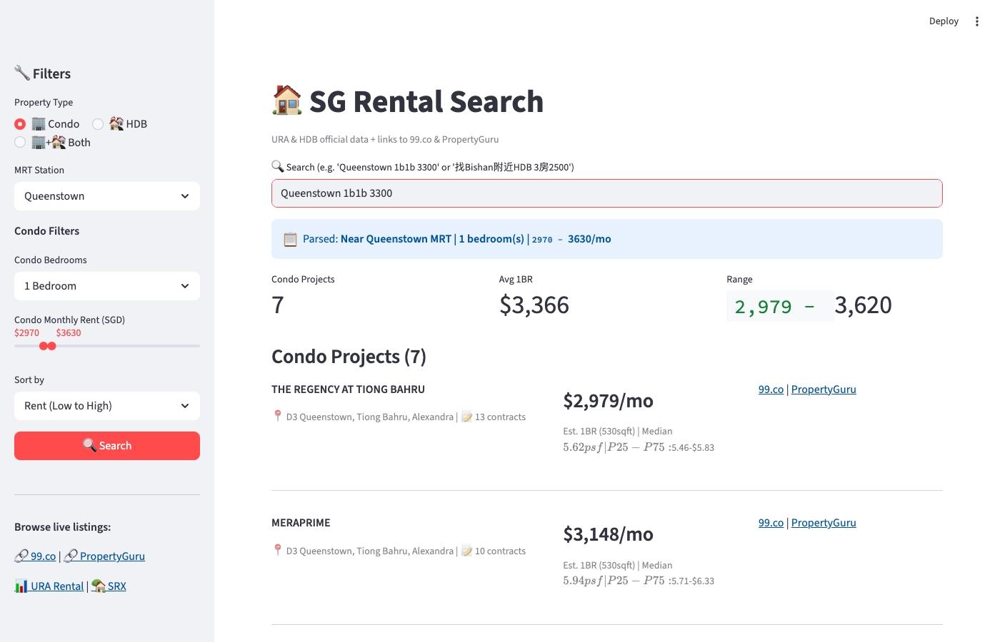
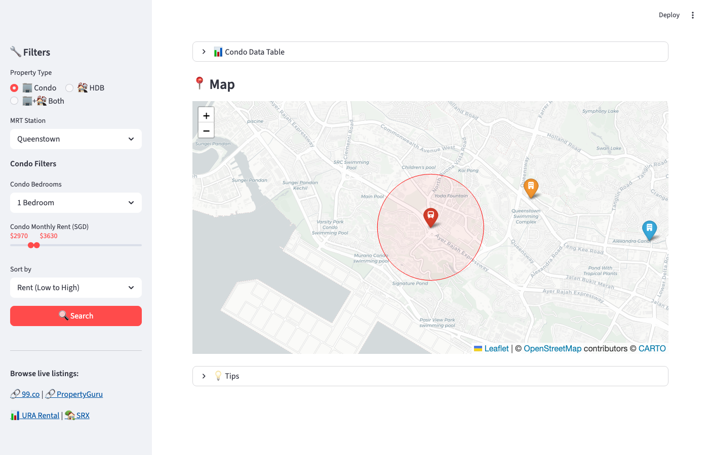
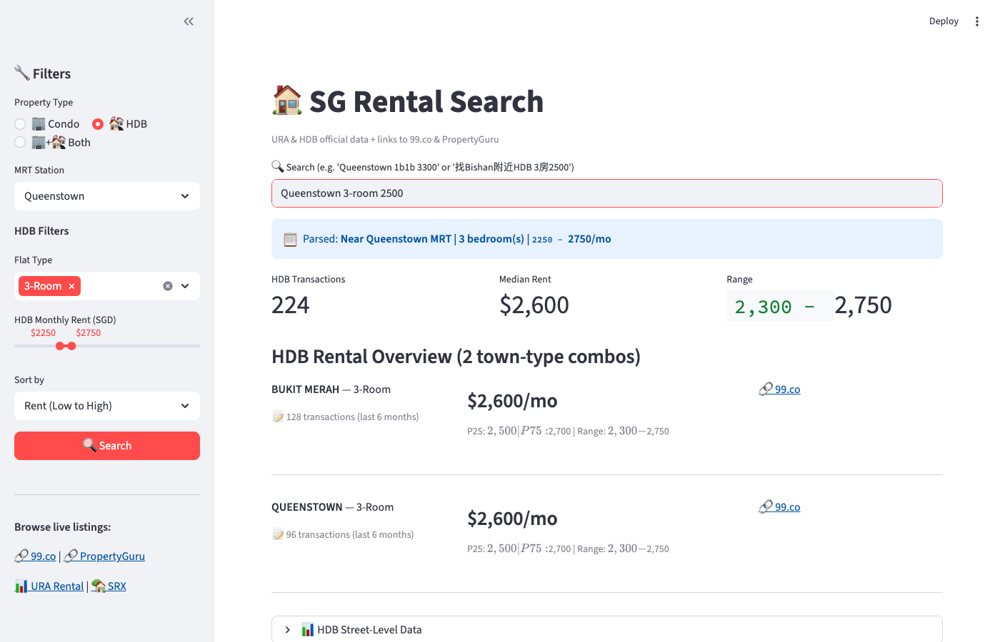
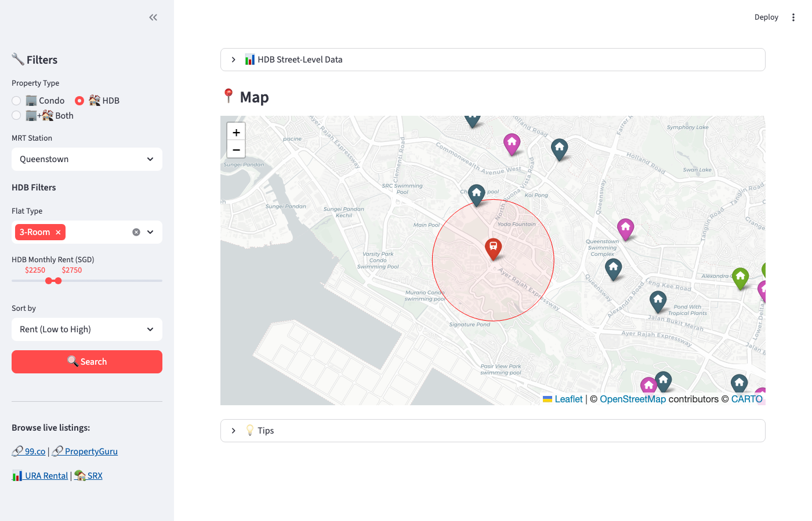

# SG Rental Search 🏠

An interactive tool for searching and comparing Singapore **Condo** and **HDB** rentals, powered by official URA & HDB data.


## Screenshots

### Home Page


### Condo Search — Queenstown 1BR ~$3,300


### Interactive Map — Condos near Queenstown MRT


### HDB Search — Queenstown 3-Room ~$2,500


### HDB Map — Street-Level Markers


## Features

- **Condo + HDB** — Toggle between Condo, HDB, or Both in one dashboard
- **Natural Language Search** — English or Chinese, e.g. `Queenstown 1b1b 3300` or `找Bishan附近HDB 3房2500`
- **Official Data** — 551 condo projects (URA) + 200K+ HDB transactions (data.gov.sg)
- **Interactive Map** — Folium map with MRT stations, color-coded markers, search radius
- **Smart Filtering** — MRT proximity, bedrooms/flat type, price range, sort by rent/popularity
- **Direct Links** — Click through to 99.co / PropertyGuru for live listings
- **Bargaining Reference** — P25-P75 price range helps you negotiate better deals

## Quick Start

```bash
# Clone
git clone https://github.com/demoleiwang/SGCondoRentalSearch.git
cd SGCondoRentalSearch

# Install dependencies
pip install -r requirements.txt

# Run
streamlit run app.py
```

Open http://localhost:8501 in your browser.

## Usage

### Option 1: Natural Language

Type your query in the search box:

| Query | What it does |
|---|---|
| `Queenstown 1b1b 3300` | 1BR condos near Queenstown MRT, ~$3,300/mo |
| `找Bishan附近2房4000以内` | 2BR condos near Bishan, max $4,000 |
| `Queenstown 3-room 2500` | HDB 3-room near Queenstown, ~$2,500/mo |
| `Holland Village studio 2500以下` | Studio near Holland Village, max $2,500 |

### Option 2: Sidebar Filters

1. Choose **Property Type** — Condo, HDB, or Both
2. Select MRT station, bedroom/flat type, and price range
3. Click **Search**

### Claude Code Integration

If you use [Claude Code](https://claude.ai/claude-code), there's a built-in skill:

```
/search-condo Queenstown 1b1b 3300
```

## How It Works

1. **Data Source** — Fetches URA condo stats + HDB rental transactions from [data.gov.sg](https://data.gov.sg)
2. **Local Cache** — Data cached locally for 24h to avoid API rate limits
3. **Rent Estimation** — Condo: median $/psf × typical unit size; HDB: actual transaction rents
4. **MRT Mapping** — Maps MRT stations to postal districts (condo) and towns (HDB)
5. **Geocoding** — Uses [OneMap API](https://www.onemap.gov.sg/) to plot locations on the map
6. **Live Listings** — Generates 99.co and PropertyGuru search URLs for each project

## Data Sources

| Source | Type | Access |
|---|---|---|
| [URA via data.gov.sg](https://data.gov.sg) | Condo rental statistics (551 projects, Q4 2025) | Free API |
| [HDB via data.gov.sg](https://data.gov.sg) | HDB rental transactions (200K+ records, 2021-2026) | Free API |
| [OneMap](https://www.onemap.gov.sg/) | Geocoding | Free API |
| [99.co](https://www.99.co) | Live rental listings | Via browser link |
| [PropertyGuru](https://www.propertyguru.com.sg) | Live rental listings | Via browser link |
| [URA Rental Transactions](https://www.ura.gov.sg/property-market-information/pmiResidentialRentalSearch) | Historical transactions | Web portal |

## Project Structure

```
├── app.py                    # Streamlit dashboard
├── config.py                 # Constants and configuration
├── engine.py                 # NL query parser + filter engine
├── geo.py                    # Haversine distance, MRT lookup, geocoding
├── requirements.txt          # Python dependencies
├── data/
│   ├── mrt_stations.json     # 140 MRT stations with coordinates
│   └── cache/                # Local data cache (auto-generated)
└── scraper/
    ├── data_gov.py           # URA condo data fetcher
    ├── hdb.py                # HDB rental data fetcher
    └── ninety_nine.py        # 99.co scraper (backup)
```

## Rental Tips

From the [rental guide](rednote_experience.txt):

1. **Find the unit number** — Google `"condo name" + brochure` for floor plans
2. **Check URA history** — Look up past rental transactions for the exact unit type
3. **Cross-reference platforms** — Compare prices across 99.co, PropertyGuru, and SRX
4. **Use P25 as your target** — The 25th percentile is a realistic bargaining target
5. **Know your leverage** — Historical data gives you concrete numbers to negotiate with

## Contributing

Issues and PRs welcome. This is a community tool — if you find better data sources or have feature ideas, please share!

## License

MIT
