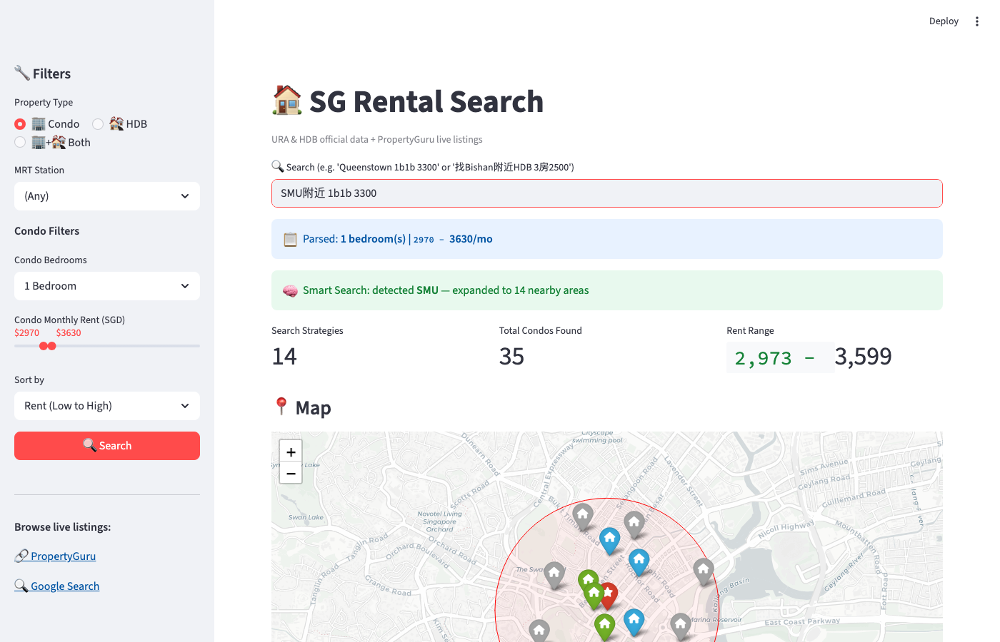
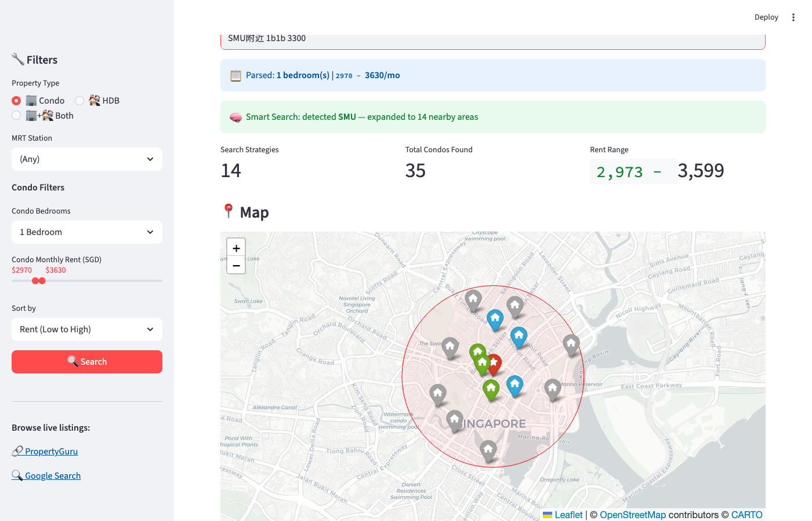
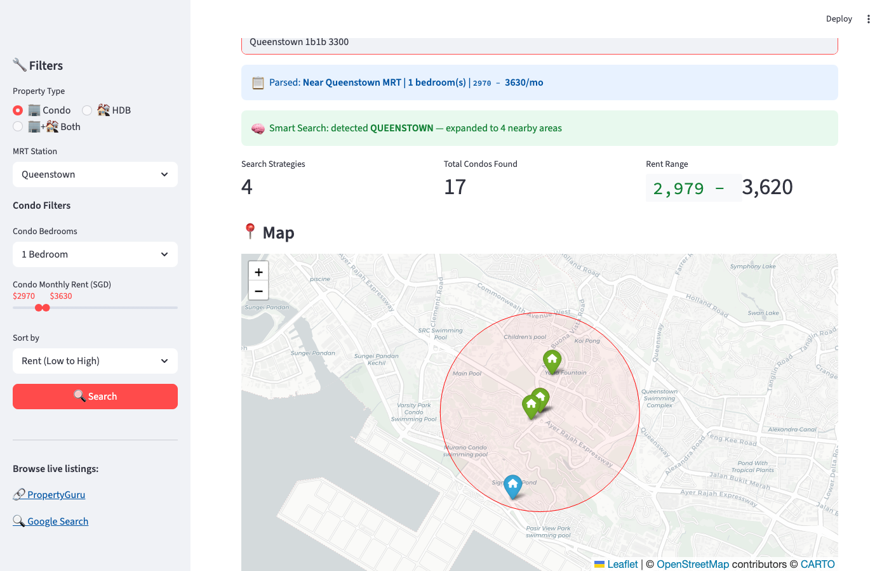
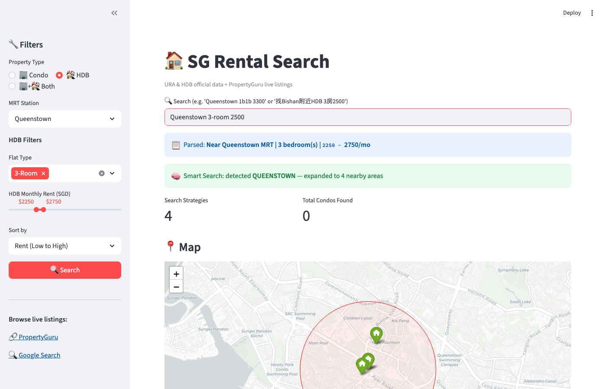

# SG Rental Search 🏠

An interactive tool for searching and comparing Singapore **Condo** and **HDB** rentals. Powered by official URA & HDB government data, with smart landmark-based search and natural language support (English + Chinese).


## Quick Start

```bash
git clone https://github.com/demoleiwang/SGCondoRentalSearch.git
cd SGCondoRentalSearch
pip install -r requirements.txt
streamlit run app.py
```

Open http://localhost:8501 in your browser.

---

## Features at a Glance

### 1. Smart Search — Type a landmark, get multi-area results

Type `SMU附近 1b1b 3300` and the system automatically:
- Detects **SMU** as Singapore Management University
- Finds **14 nearby MRT stations** (Bras Basah, City Hall, Bugis, Dhoby Ghaut, ...)
- Searches condos near **each station** with your budget
- Returns **35 condos** across all areas, grouped and ranked by distance




**Supported landmarks:** SMU, NUS, NTU, SUTD, SIM, CBD, MBFC, OUE Downtown, Mapletree Business City, one-north, Changi Business Park, SGH, NUH, TTSH, Orchard, and more.

### 2. Condo Search — Filter by MRT, price, bedrooms




### 3. HDB Search — Real transaction data




### 4. Home Page — Popular searches, quick start


---

## Search Examples (130+ tested)

### Basic Condo Searches
| Query | Result |
|---|---|
| `Queenstown 1b1b 3300` | 1BR condos near Queenstown MRT, ~$3,300/mo |
| `Bishan 2 bedroom 4000` | 2BR condos near Bishan, ~$4,000/mo |
| `Novena 1br 3500` | 1BR near Novena, ~$3,500/mo |
| `Holland Village 2b2b 4800` | 2BR near Holland Village, ~$4,800/mo |
| `Dhoby Ghaut studio 2500` | Studio near Dhoby Ghaut, ~$2,500/mo |

### Price Range Patterns
| Query | Result |
|---|---|
| `Queenstown 1br 3000-3500` | Exact range $3,000-$3,500 |
| `Novena 1 bedroom 3000 to 4000` | Range with "to" |
| `$3,000-$3,500 1br Bishan` | Dollar signs supported |
| `Orchard 1br under 4000` | Max $4,000 |
| `Clementi 2br at least 3000` | Min $3,000 |
| `Bishan 1b1b 3500以内` | Chinese "以内" = max |
| `Newton 3br 6000以上` | Chinese "以上" = min |

### Smart Search (Landmarks)
| Query | What happens |
|---|---|
| `SMU附近 1b1b 3300` | Expands to 14 nearby MRT stations, finds 35 condos |
| `NUS附近 1br 2500-3500` | Finds condos near Kent Ridge, Buona Vista, one-north |
| `CBD附近 2br 5000` | Searches across Raffles Place, Tanjong Pagar, Downtown area |
| `找NTU附近的2房 3000左右` | Chinese + landmark + approximate price |

### HDB Searches
| Query | Result |
|---|---|
| `Queenstown 3-room 2500` | HDB 3-room near Queenstown, ~$2,500/mo |
| `Bishan 4-room 3000` | HDB 4-room near Bishan |
| `Tampines 5-room 3500` | HDB 5-room near Tampines |
| `executive flat Bishan 5000` | HDB Executive near Bishan |
| `Sengkang 3-room 2000-2500` | HDB with price range |

### Facing & Floor
| Query | Result |
|---|---|
| `Queenstown 1b1b 3300 south facing` | Filter by south facing |
| `朝南的1房 Novena 3500` | Chinese south facing |
| `southeast facing Queenstown 3000` | SE facing |
| `high floor 1br Queenstown 3500` | Floor >= 15 |
| `高楼层 Bishan 2房 4500` | Chinese high floor |
| `Novena 1br min floor 10` | Explicit floor >= 10 |
| `10楼以上 Bishan 2房 4000` | Chinese "10楼" = floor >= 10 |

### Chinese Queries
| Query | Result |
|---|---|
| `找Queenstown附近1房3300左右` | 1BR ~$3,300 |
| `在Bishan地铁站附近租2房，预算4000以内` | 2BR max $4,000 |
| `Queenstown附近有没有3000以下的1房` | 1BR under $3,000 |
| `帮我筛选Novena附近朝南的1b1b月租3500` | South facing, ~$3,500 |
| `Clementi地铁站500米内的2房，不超过4500` | 500m radius, max $4,500 |
| `Redhill附近2房朝南高楼层 4500以内` | South + high floor + max $4,500 |

> All 130 examples are in [`examples.py`](examples.py). Run `python examples.py` to verify.

---

## Claude Code Integration

Two built-in skills for [Claude Code](https://claude.ai/claude-code) users:

```bash
# Basic search
/search-condo Queenstown 1b1b 3300

# Smart search with landmarks
/smart-search SMU附近 1b1b 3300
/smart-search 找NUS附近的1房 2500以内
```

---

## How It Works

```
User Query → NL Parser → Smart Expand (if landmark) → Multi-station Search → Aggregate & Display
                              ↓
                    Geocode landmark via OneMap
                    Find nearby MRT stations (1.5km)
                    Generate search per station
```

1. **Natural Language Parser** — Regex-based extraction of MRT stations, bedrooms, price, facing, floor, radius (supports English + Chinese)
2. **Smart Expand** — Detects landmarks (universities, offices, etc.), geocodes them, finds nearby MRT stations, generates multiple search strategies
3. **Data Source** — URA condo rental statistics + HDB rental transactions from [data.gov.sg](https://data.gov.sg), cached locally for 24h
4. **Rent Estimation** — Condo: median $/psf × typical unit size; HDB: actual approved transaction rents
5. **MRT Mapping** — 140 MRT stations mapped to postal districts (condo) and towns (HDB)
6. **Live Listings** — PropertyGuru search links + Google search fallback for each project

## Data Sources

| Source | Data | Update Frequency |
|---|---|---|
| [URA via data.gov.sg](https://data.gov.sg) | 551 condo projects — median rent/psf, P25-P75, contract volumes | Quarterly |
| [HDB via data.gov.sg](https://data.gov.sg) | 200K+ rental transactions — actual approved monthly rents | Monthly |
| [OneMap](https://www.onemap.gov.sg/) | Address geocoding, MRT station coordinates | Real-time |
| [PropertyGuru](https://www.propertyguru.com.sg) | Current rental listings (via browser link) | Live |

## Project Structure

```
├── app.py                    # Streamlit dashboard (main UI)
├── engine.py                 # NL query parser + filter engine
├── smart_search.py           # Landmark detection + multi-area expansion
├── commute.py                # MRT commute analysis
├── geo.py                    # Haversine distance, MRT lookup, OneMap geocoding
├── config.py                 # Constants and configuration
├── examples.py               # 130 test query examples
├── requirements.txt
├── data/
│   ├── mrt_stations.json     # 140 MRT stations with coordinates
│   └── cache/                # Local data cache (auto-generated, 24h TTL)
├── scraper/
│   ├── data_gov.py           # URA condo data fetcher + URL builders
│   ├── hdb.py                # HDB rental data fetcher
│   └── ninety_nine.py        # 99.co scraper (backup, Cloudflare-blocked)
├── tests/
│   ├── test_engine.py        # 82 tests — parser, filter, geo, data
│   ├── test_commute.py       # 20 tests — commute analysis
│   ├── test_smart_search.py  # 23 tests — landmark detection, expansion
│   └── test_urls.py          # 17 tests — URL format, reachability
└── .claude/commands/
    ├── search-condo.md       # /search-condo skill
    └── smart-search.md       # /smart-search skill
```

## Testing

```bash
# Run all 142 tests
python -m pytest tests/ -v

# Run example queries (130 NL parsing tests)
python examples.py
```

## Rental Tips

From the [rental guide](rednote_experience.txt):

1. **Find the unit number** — Google `"condo name" + brochure` for floor plans
2. **Check history** — Use PropertyGuru to look up past rental transactions
3. **Use P25 as your target** — The 25th percentile rent is a realistic bargaining target
4. **Cross-reference** — Compare prices across PropertyGuru, SRX, and Google
5. **Know your leverage** — Show historical data when negotiating with agents

## Contributing

Issues and PRs welcome! If you find better data sources or have feature ideas, please share.

## License

MIT
